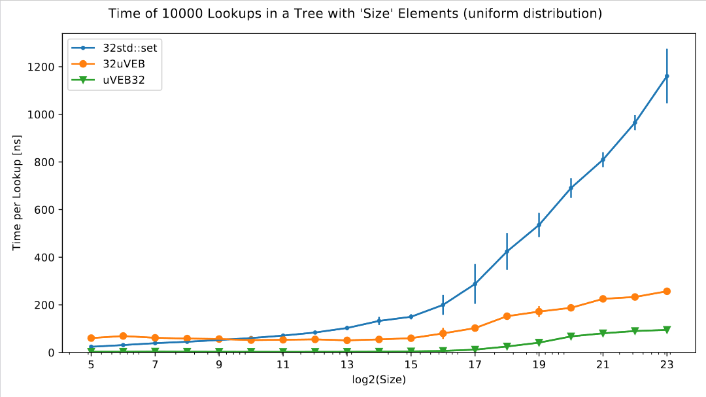
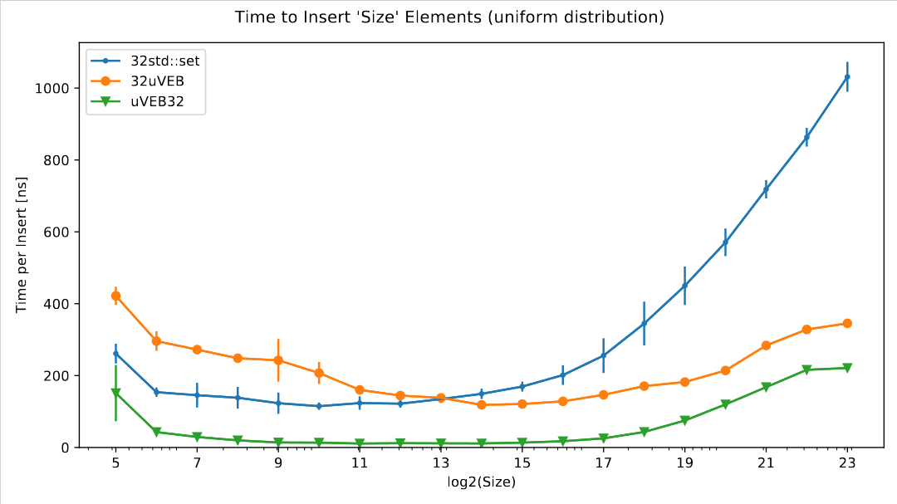
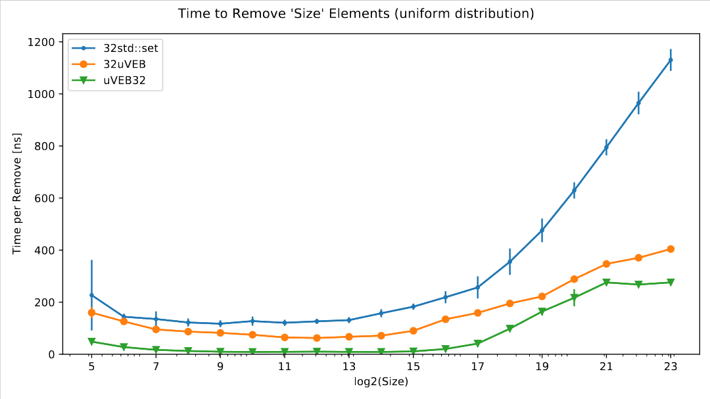
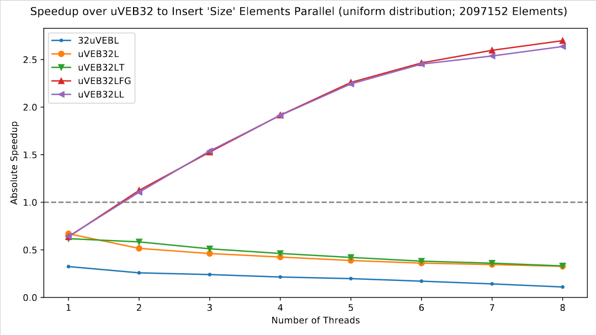

# Van Emde Boas Tree

This repository contains a generic van Emde Boas (vEB) implementation, a specialized implementation for 32-bit values (signed/unsigned integers and float) as well as various concurrent implementations. The 32-bit implementation is based on a paper by Dementiev et al. [[1]](#1). Both sequential implementations outperform std::set by a great margin.

This project was part of an university project. Currently, only insert, remove and lower_bound are implemented. Note that they currently do not comply to the C++ standard (this may change in the future). Therefore, it is not suitable as a drop-in replacement for std::set.

For a quick overview, see the [presentation](./presentation/slides.pdf).

## Performance

The sequential implementations outperform std::set by a great margin. The parallel implementations can achieve a small speedup for inserting random keys.

For more measurement, see [the corresponding folder](./measurements/) or perform your own measurements.

## Build

Using CMake, make and GCC:

mkdir build  
cd build  
cmake ..  
make

## Dependencies

This project has two dependencies. All required files are contained in [utils](./utils/). Furthermore, the dependencies can be turned off using preprocessor macros. This, however, may yield worse performance.

- [flat_hash_map.hpp](./utils/flat_hash_map.hpp) and [bytell_hash_map.hpp](./utils/bytell_hash_map.hpp) by Malte Skarupke [https://github.com/skarupke/flat_hash_map](https://github.com/skarupke/flat_hash_map): They are used as a fast alternative to std::unordered_map. By default, bytell_hash_map is used.

- [safe_ptr.h](./utils/safe_ptr.h) from [https://github.com/AlexeyAB/object_threadsafe](https://github.com/AlexeyAB/object_threadsafe). Specifically, the contention_free_shared_mutex is used in the concurrent implementations as a fast alternative to std::shared_mutex.

## License

This project is licensed under the [MIT License](LICENSE). Note that the dependencies may have other licenses.

## References
<a id="1">[1]</a>
Dementiev, Roman, Lutz Kettner, Jens Mehnert and Peter Sanders. “Engineering a Sorted List Data Structure for 32 Bit Key.” ALENEX/ANALC (2004).